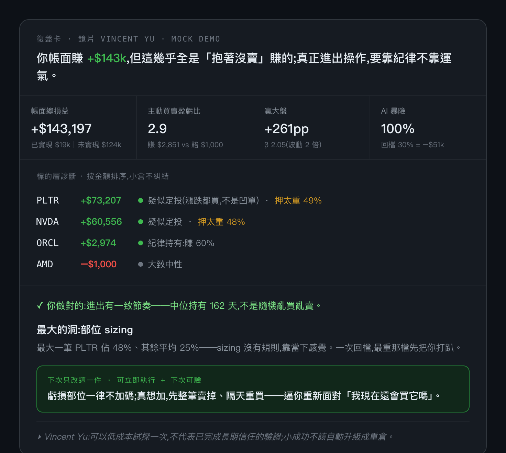

# FOMO Kernel

> 一個 Claude Code skill:用**一面大師鏡片**(預設一套交易原則蒸餾、可換),把你的真實交易復盤成**一張卡**——
> 你做對的一件事 + 一個最大的洞(用你自己的數字)+ 一條下次要守的規矩 + 一句大師的話。

不是又一份統計報表。它做的是報表做不到的事:**先算出你看不見的行為漏洞,再問出你不願承認的動機,最後逼你下次只改一件事。**

## Quick start

**完整流程(這才是產品本體)—— 在 Claude Code 裡:**
```
/fomo-kernel                      # 沒給資料 → 跑內建 mock,走完「引擎診斷 → 對話問動機 → 定論卡」
/fomo-kernel ~/Downloads/my.csv   # 復盤你自己的交易(任何券商 CSV)
```
卡的價值在第 ② 步那段對話 —— 引擎挑出可疑標的、問你「逢低還是凹單?」,你一句話定案,卡才出定論。**光看引擎原始輸出看不到這層。** 安裝見下方 [安裝](#安裝)。

**想先零安裝、看引擎在算什麼**(機械層的*原始診斷*,還不是定論卡):
```bash
git clone https://github.com/atomchung/fomo-kernel && cd fomo-kernel
pip install -r requirements.txt
cd skills/fomo-kernel && python3 engine/trade_recap.py   # 跑內建 mock,印出引擎原始診斷
```

## 跑出來長什麼樣

跑內建 mock 的**引擎原始診斷**長這樣(這是機械層輸出;真正的定論卡是 Claude 在 Step ② 對話問完動機後才收斂的):

```text
復盤卡 · 大師鏡片 · mock demo
你帳面賺 +$143k,但幾乎全是「抱著沒賣」賺的;真正進出操作,要靠紀律不靠運氣。

  帳面總損益      +$143,197    (已實現 $19k + 未實現 $124k)
  主動買賣盈虧比   2.9          (平均賺 $2,851 vs 賠 $1,000)
  贏大盤 +261pp · β 2.05 · AI 暴險 100%(回檔 30% = −$51k)

標的層診斷(按金額排序,小倉不糾結):
  PLTR  +$73,207   [v] 疑似定投(漲跌都買,不是凹單) · [!] 押太重 49%
  NVDA  +$60,556   [v] 疑似定投 · [!] 押太重 48%
  ORCL   +$2,974   [v] 紀律持有:賺 60%
  AMD    -$1,000   --  大致中性

[v] 你做對的:進出有一致節奏,中位持有 162 天
[X] 最大的洞:部位 sizing — 最大一筆 PLTR 佔 48%,其餘平均 25%
[*] 下次只改:虧損部位一律不加碼;真想加,先整筆賣掉、隔天重買
 >  鏡片原則:可以低成本試探一次,不代表完成長期信任的驗證
```

同一張卡的視覺版(深色卡片):



> 真實使用時,引擎還會挑出「金額大 + 虧損中狂加碼」的標的,在**出卡前**先問你「這是逢低還是凹單?」——機械分不出的動機,你一句話定案,卡才出定論。
> ⚠️ mock 的 α 數字會失真(持倉太集中、橫截面太窄),demo 別當真;真實多元持倉才看 α。

---

## 它跟「貼對帳單給 ChatGPT」差在哪

ChatGPT 算不出 FIFO 配對的真實 α/β、分不清你是「定投」還是「凹單」、也沒有你的歷史。這個 skill 三層遞進:

1. **機械層(Python,確定性精算)** — 算 ChatGPT 估不準的東西:
   - 5 維行為診斷:部位 sizing / 加碼攤平 / 出場 / 分散 / 持有一致性
   - **標的層診斷**:按**金額**排序每檔(小倉不糾結),主從分類器分「疑似定投 vs 疑似凹單 vs 待確認」
   - **報酬歸因**:把「贏大盤」拆成「押對賽道(運氣/方向)」vs「選股(技巧)」——讓你看清賺的是本事還是膽子
2. **鏡片層(大師原則 × 對話)** — 機械分不出的「為什麼」,出卡前問你:
   - 持股假設:「MSTR 一路加碼還虧,是還相信 thesis,還是不想認賠在凹單?」
   - 動機:「賣掉賺錢的賣太早,是 thesis 到價,還是怕回吐?」
   - **機械挑該問的少數標的,你的答案定性**——機械永遠在猜,你一句話定案
3. **處方層** — 從「你哪裡爛」進到「下一步換什麼做法」:揚長(放大你的 edge)/ 砍損耗(機械規則,下次可驗)

→ 最後收斂成**一張卡**,一個洞、一條下次能驗的規矩。第二次來,先對帳「上次那條守了沒」。

## 🔒 隱私:不上傳後端、作者拿不到

- skill 在**你自己的機器**上跑你的 CSV,**不上傳到任何後端、不落地儲存到別處、不寫進記憶**。
- 作者拿不到你的交易明細。唯一(自願)回收的是一句「這張卡有沒有用」,不含交易內容。
- `.gitignore` 已設:**任何 `.csv` 都不會被 commit**,只有 mock/sample 假資料例外。
- 精確說:唯一會讀到你交易的,是你**正在用的 Claude 本身**——它要讀 CSV 才能幫你復盤,就跟你平常用 Claude 一樣。這跟把對帳單交給一個會存檔、你看不到、作者能撈的 SaaS,是兩回事(所以不是「完全不經過任何伺服器」,而是「不落地、不回作者、不進第三方」)。

## 📁 你的教練記憶在哪 / 怎麼維護

第二次來,卡會先對帳「上次那條規矩守了沒」——這靠三個**純本機**檔撐起來(都在 `~/.trade-coach/`,永不外傳、不回作者):

```bash
cat ~/.trade-coach/log.jsonl       # 每行一次復盤(薄 metric + 你承諾的規矩);空 = 第一次
cat ~/.trade-coach/theses.jsonl    # 每筆持倉的「為什麼持有 + 什麼條件算錯」(append-only,不覆蓋)
cat ~/.trade-coach/profile.md      # 你的交易目標 + 3 條個人原則(復盤對照基準)
cat ~/.trade-coach/last_state.json # 最近一次引擎算出的薄狀態(含各持倉 shares/cost,對帳用;每次跑覆蓋)
```

- **看歷次復盤** → `cat ~/.trade-coach/log.jsonl`。
- **換哲學鏡片重來 / 清空對帳基準** → 刪掉或改名 `~/.trade-coach/`(刪了下次就當第一次)。
- **thesis 寫歪了** → 改 `theses.jsonl`;它是 append-only,修正 = 補一筆新 event(別蓋舊的,才能跨期看你當初怎麼想、後來怎麼變)。
- **隱私自證**:教練記憶就在 `~/.trade-coach/` 這幾個檔、全在你機器上,作者那邊一行都沒有。

> 💡 **想分享給社群?** 卡預設只出完整私人版。對我說「給我分享版」,會輸出**去敏感化**的純文字版(隱藏金額 / 股數 / 精確佔比,只留行為 pattern + 相對績效 β/贏大盤 pp),可直接貼 X / Thread。

## 安裝

需要 Python 3.11+:
```bash
pip install -r requirements.txt           # yfinance + pandas
```
把 skill 掛進 Claude Code(二選一):
```bash
ln -s "$(pwd)/skills/fomo-kernel" ~/.claude/skills/fomo-kernel   # A. symlink(推薦)
cp -r skills/fomo-kernel ~/.claude/skills/                         # B. 複製(給別人用)
```

## 用法

在 Claude Code 裡:
```
/fomo-kernel                      # 沒給資料 → 跑內建 mock,看一次完整 demo
/fomo-kernel ~/Downloads/my.csv   # 復盤你自己的交易
```
你的 CSV 來自**任何券商**都行——Claude 會自動讀懂、轉成引擎要的欄位(`Symbol / Action(BUY|SELL) / Quantity / Price / TradeDate`),不必你手動整理。

> 🏷️ **冷門股**(引擎 sector 表不認的)Claude 會**自動產生 driver map** 給你確認(每檔標 `[sector, 主題]`),讓「分散」維不會把同主題的標的當成真分散——不必你手動弄,也別讓它落到 `driver map: 0 檔` 的 fallback(分散維會失準)。細節見 SKILL Step 0.5。

**會發生什麼**:① 引擎跑診斷 → ② Claude 在對話裡問你 1–3 個持股假設/動機問題(逢低還是凹單?)→ ③ 拿到你的答案,出一張定論卡。卡的版型見 [`card-template.html`](skills/fomo-kernel/card-template.html)(完整四層的 HTML 範例)。

## 三組風格 sample(直接可跑,看不同風格照出不同洞)

`mock/` 下有四組**虛構**交易,各觸發一種典型洞。完整設計見 [`mock/SAMPLES.md`](skills/fomo-kernel/mock/SAMPLES.md):

```bash
cd skills/fomo-kernel
TR_DRIVER_MAP=mock/sample_fundamental.driver_map.json python3 engine/trade_recap.py mock/sample_fundamental.csv
TR_DRIVER_MAP=mock/sample_momentum.driver_map.json    python3 engine/trade_recap.py mock/sample_momentum.csv
TR_DRIVER_MAP=mock/sample_value.driver_map.json       python3 engine/trade_recap.py mock/sample_value.csv
python3 engine/trade_recap.py                          # 不帶參數 = mock_trades.csv
```

| sample | 風格 | 該照出的頭號洞 |
|---|---|---|
| `sample_fundamental` | 基本面選股 | 出場紀律(賺錢抱 120 天就跑、賠錢抱 378 天等回本) |
| `sample_momentum` | 動能衝衝衝 | 部位梭哈 + 假分散(把 beta 當 alpha) |
| `sample_value` | 只買便宜 | 加碼攤平(越跌越凹,把 INTC 凹成 43% 重倉) |
| `mock_trades` | 方法論建立期 | FOMO 全 AI 假分散 + PLTR 攤平 |

> ⚠️ 引擎用 yfinance 抓真實歷史價算 α/β、市值、套牢,**重跑時絕對數字會隨當前股價漂移**;但每組設計觸發的頭號洞是穩定的(由交易行為決定,不靠特定股價)。

## 結構

```
skills/fomo-kernel/
  SKILL.md                  ← skill 本體(四步流程:格式 → 引擎 → 出卡前確認 → 定論卡)
  engine/trade_recap.py     ← 機械層:5 維 + 標的層主從分類 + 歸因(純函式,無真實路徑)
  rubric/
    vincent-yu.md           ← 預設鏡片的原則蒸餾(逐條標出處;可換成別的大師)
    vincent-yu.lens.json    ← 鏡片的「可換大師層」:規矩/引言/動機問句(換大師 = 換這檔)
  behavior-diagnosis.md     ← 診斷哲學:對事不對人、行為多標籤(why 的設計記錄)
  card-template.html        ← 復盤卡 HTML 版型範例
  mock/                     ← 四組 sample 假資料 + 各自 driver map + SAMPLES.md
```

## 免責

預設鏡片來自一位投資人公開文章的原則蒸餾(來源逐條標在 `rubric/` 裡),屬引用非轉載、非經本人背書;鏡片可換,之後會補多位。
本工具定位 **research / coaching support**,所有輸出僅為交易行為回顧與紀律建議,**不構成投資建議、不涉及任何標的買賣推薦**;最終投資決策與結果由使用者自負。
